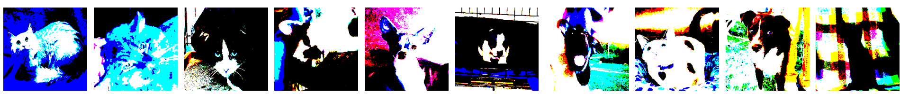
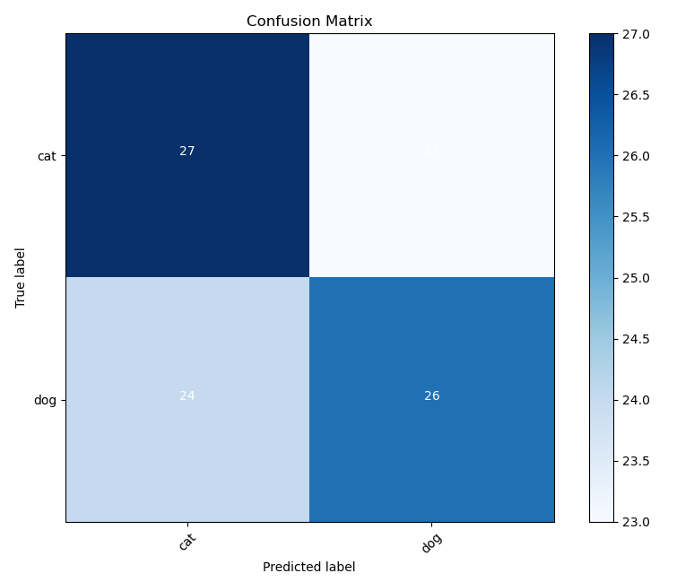

# cnn-keras

This project is using Keras, a neural network API written in Python and integrated with TensorFlow, to classify dogs and cats.
It is build and trained on convolutional neural networks (CNNs)

## Prepare and Process Data 

To train our keras model we are using the following [dataset from kaggle](https://www.kaggle.com/competitions/dogs-vs-cats/overview)

## Build & Train the Model

Training the model using the Adam Optimizer

## Predicting 

Preditcting our test data

Example CM Output using PLT

## Literature
Bases on https://www.youtube.com/watch?v=qFJeN9V1ZsI